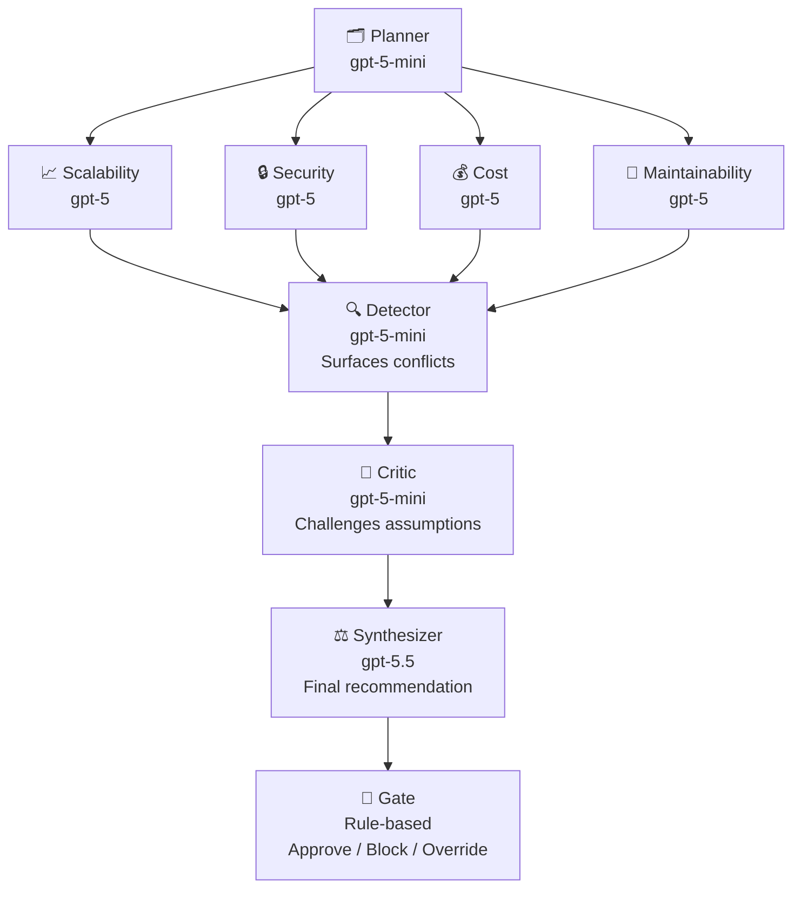

# DecisionDesk

A real-time, multi-agent architecture review system. You describe a binary infrastructure decision — PostgreSQL vs DynamoDB, monolith vs microservices, REST vs GraphQL — and eight specialised LLM agents analyse it in parallel, surface conflicts, critique assumptions, and deliver a structured verdict via a streaming WebSocket interface.

Built as a backend engineering portfolio project demonstrating multi-agent orchestration, LangGraph parallel execution, human-in-the-loop revision, and production observability.

---

## Architecture



The four specialist agents run **concurrently** via LangGraph's parallel fan-out, reducing wall time by ~1.8× vs sequential execution (~21s vs ~37s mean TTA).

---

## Agent Roles

| Agent | Model | Role |
|---|---|---|
| **Planner** | gpt-5-mini | Frames the decision, writes targeted sub-questions for each specialist |
| **Scalability** | gpt-5 | Throughput ceilings, horizontal scaling limits, data growth |
| **Security** | gpt-5 | Attack surface, auth boundaries, compliance posture |
| **Cost** | gpt-5 | TCO, cost curves, egress fees, operational overhead |
| **Maintainability** | gpt-5 | Team fit, debugging story, migration risk, long-term debt |
| **Detector** | gpt-5-mini | Identifies recommendation conflicts and risk contradictions across specialists |
| **Critic** | gpt-5-mini | Challenges assumptions, surfaces collective blind spots |
| **Synthesizer** | gpt-5.5 | Weighs all outputs, produces option_a / option_b / hybrid verdict |
| **Gate** | rule-based | Blocks approval if critic requires revision or detector found blocking conflicts |

Model routing cuts cost to **under $0.10 per review cycle** — 3.5× cheaper than naive single-model routing.

---

## Human-in-the-Loop Revision

If the gate blocks a decision, the frontend presents the critic's issues as checkboxes. The user selects which concerns they acknowledge, adds optional context, and re-submits. The revision graph (synthesizer → gate only, critic skipped) re-runs with the user's input woven into the synthesizer prompt and `force_approve=True`, producing a final recommendation without a second critique pass.

---

## Stack

| Layer | Technology |
|---|---|
| Agent orchestration | [LangGraph](https://github.com/langchain-ai/langgraph) `StateGraph` with parallel fan-out |
| LLM API | OpenAI Responses API (`client.responses.parse`) with Pydantic structured output |
| Backend | FastAPI + uvicorn, WebSocket streaming (`astream stream_mode="updates"`) |
| Frontend | Vanilla JS, Tailwind CSS, single-file `index.html` |
| Observability | Prometheus metrics + Grafana dashboard + SLO alerting |
| Containerisation | Docker + Docker Compose |
| CI/CD | GitHub Actions → GHCR → Hetzner (SSH deploy) |

---

## Quickstart

**Prerequisites:** Python 3.11+, an OpenAI API key.

```bash
git clone <repo>
cd decision-desk

python -m venv .venv && source .venv/bin/activate
pip install -e .

export OPENAI_API_KEY=sk-...
uvicorn decisiondesk.main:app --reload
```

Open [http://localhost:8000](http://localhost:8000).

---

## With Observability Stack

```bash
export OPENAI_API_KEY=sk-...
docker compose up -d
```

| Service | URL |
|---|---|
| App | http://localhost:8080 |
| Prometheus | http://localhost:9090 |
| Grafana | http://localhost:3000 (admin / admin) |

Grafana auto-provisions a dashboard with active sessions, P50/P95/P99 review latency, and gate outcome breakdown. Two SLO alerts fire if P95 > 60s or error rate > 5%.

---

## API

### WebSocket — `/ws/review`

Send one JSON message to start a review:

```json
{
  "type": "start",
  "question": "Should we use PostgreSQL or DynamoDB?",
  "option_a": "PostgreSQL (RDS)",
  "option_b": "DynamoDB",
  "constraints": {
    "team_size": "small",
    "traffic": "high",
    "budget": "medium"
  }
}
```

The server streams events as each agent completes:

```
state_initialized
agent_started    { agent: "planner" }
agent_completed  { agent: "planner", output: {...} }
agent_started    { agent: "scalability" }   ┐
agent_started    { agent: "security"   }   │ parallel — arrive in any order
agent_started    { agent: "cost"       }   │
agent_started    { agent: "maintainability" } ┘
...
review_complete  { approved: true, recommendation: "option_a", confidence: 0.82, ... }
```

### WebSocket — `/ws/revise`

Human-in-the-loop revision pass. Re-runs synthesizer → gate with user-acknowledged issues and additional context. Critic is skipped.

### REST — `POST /review`

One-shot synchronous review. Returns the full agent trace as JSON. Useful for scripting.

---

## Scripts

```bash
# Parallel vs sequential TTA benchmark (5 decisions, ~40 LLM calls)
python scripts/benchmark.py

# Token-level cost accounting (10 decisions, mixed vs naive routing)
python scripts/cost_report.py --runs 10

# k6 WebSocket load test
k6 run scripts/k6_load_test.js
```

---

## Project Structure

```
decision-desk/
├── src/decisiondesk/
│   ├── agents/          # One file per agent (planner, 4 specialists, detector, critic, synthesizer, gate)
│   ├── core/
│   │   ├── schema.py    # Pydantic I/O schemas for all agents
│   │   └── state.py     # DecisionState, GateTier enum
│   ├── graph/
│   │   ├── parallel.py  # Primary graph: fan-out → fan-in → sequential chain
│   │   ├── revision.py  # Revision graph: synthesizer → gate only
│   │   └── nodes.py     # LangGraph node wrappers + LGState TypedDict
│   └── main.py          # FastAPI app, WebSocket handlers, Prometheus metrics
├── infra/
│   ├── prometheus.yml
│   ├── alerting_rules.yml
│   └── grafana/         # Auto-provisioned datasource + dashboard
├── scripts/
│   ├── benchmark.py
│   ├── cost_report.py
│   └── k6_load_test.js
├── index.html           # Frontend (single file)
├── Dockerfile
├── docker-compose.yml
└── .github/workflows/deploy.yml
```

---

## Deployment (Hetzner)

1. Set repository secrets: `HETZNER_HOST`, `HETZNER_USER`, `HETZNER_SSH_KEY`, `OPENAI_API_KEY`
2. On the Hetzner VPS, create `/opt/decisiondesk/` and place a `.env` file there
3. Push to `main` — GitHub Actions builds the image, pushes to GHCR, and SSH-deploys via `docker compose pull && up -d`

---

## Prometheus Metrics

| Metric | Type | Description |
|---|---|---|
| `decisiondesk_active_sessions_total` | Gauge | WebSocket sessions currently open |
| `decisiondesk_review_duration_seconds` | Histogram | End-to-end wall time per review |
| `decisiondesk_reviews_total{outcome}` | Counter | Reviews by outcome: approved / rejected / error |

---

## Key Design Decisions

**Flat TypedDict state over nested objects** — LangGraph parallel fan-out writes to shared state concurrently. Each agent owns a single key (`scalability`, `security`, etc.) eliminating merge conflicts without custom reducers.

**`astream(stream_mode="updates")` over `astream_events`** — yields one chunk per completed node, reliable across fan-in boundaries. `astream_events` had naming mismatches that caused the connection to drop after the parallel phase.

**Critic skipped in revision pass** — early revision loops sent the critic a second time, which found new issues and re-blocked the gate. The fix: pre-populate a cleared `CriticOutput` and run synthesizer → gate only. The user reviewing issues *is* the critic pass.

**Structured output via Responses API** — `client.responses.parse()` with Pydantic schemas. Required replacing all `Dict[str, Any]` fields with concrete models (`ConflictItem`) so OpenAI can enforce `additionalProperties: false`.

**Reasoning token stripping** — `output_tokens` from the Responses API includes hidden chain-of-thought tokens for gpt-5.5. Cost accounting subtracts `output_tokens_details.reasoning_tokens` so reported costs reflect billed output only.
